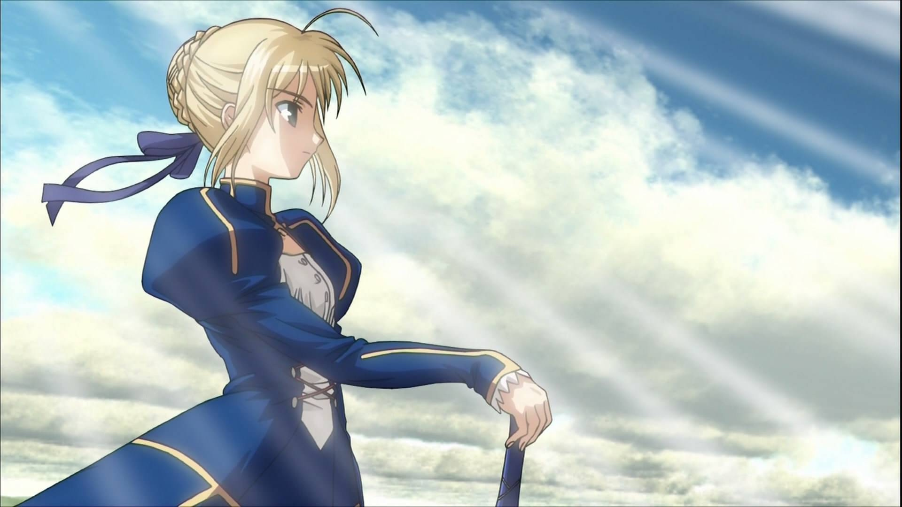
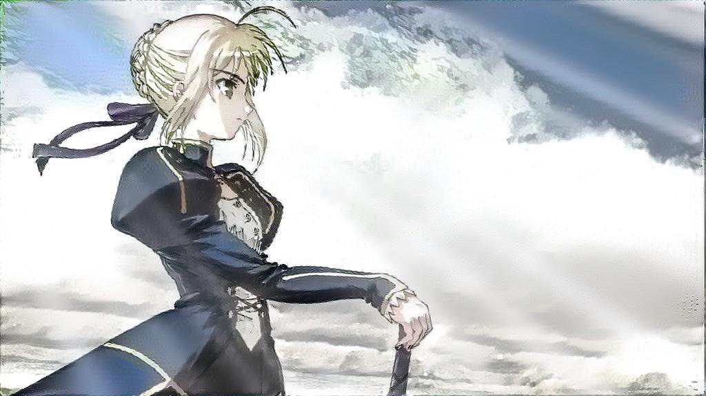
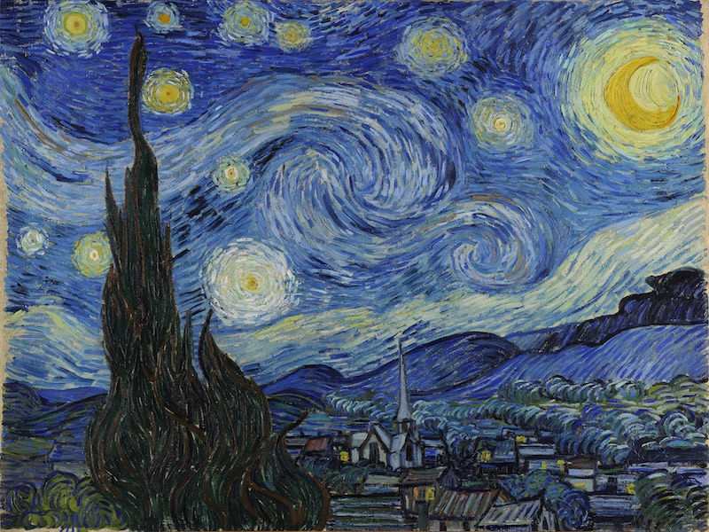
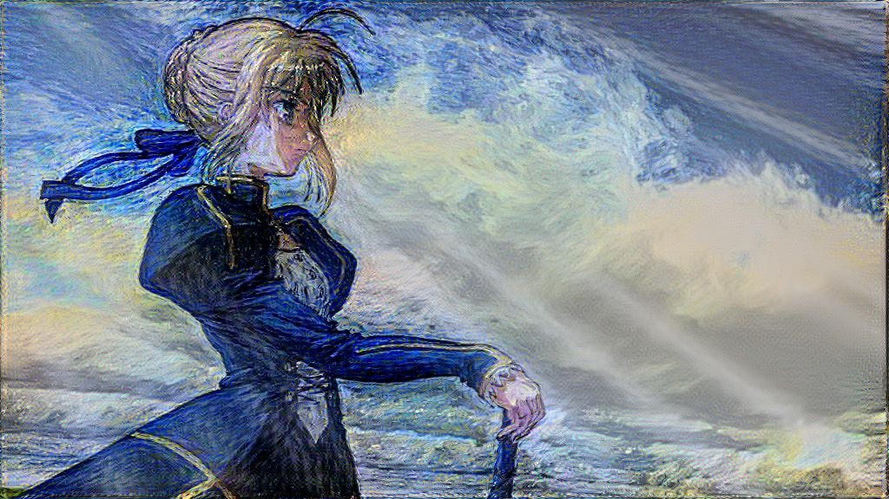

# 风格迁移
## 运行环境
* CUDA 8.0
* Cudnn 6.5
* Python 3.5+  

## python依赖
* pip install numpy
* pip install tensorflow-gpu
* pip install Pillow

## 算法原理
### 原理概述
通过CNN网络提取图片特征.根据图片特征计算图片的content loss和style loss,通过最小化两个loss之和,从而生成新的风格迁移图片
### 特征提取
通过与训练的vgg19模型对图片进行前向传播运算,获得各个层级的特征
### Content Loss
content loss代表内容图片与生成图片的再内容上的相似程度
$$L_{content}=\frac{1}{2}\sum_{i,j} (G_{ij}-C_{ij})^2$$
通过平方差来计算content loss,$G$表示生成图片的特征值,shape为[1,h,w,c]的矩阵,$C$表示生成图片的特征值,shape与$G$相同. 
实验中使用conv4_2层特征来计算Content Loss
### Style Loss
style loss代表风格图片与生成图片在风格上的相似程度.图片风格与内容不同不能直接使用特征矩阵表示,这里使用Gram矩阵表示图片风格.
Gram矩阵:
$$G_{ij}^l = \sum_{k}M_{ik}^lM_{jk}^l$$
i,j表示gram矩阵坐标,l表示vgg网络中的层级
图片特征矩阵为[1,h,w,c],一共有c种特征,[h,w]代表图片上的坐标,通过将图片每个位置的特征两两相乘之和来表示图片风格,最后的Gram矩阵为[c,c]
将特征值看作是特征的似然概率,两两相乘则表示两个特征在对应位置同时出现的概率.
$$L_{style}^l=\frac{1}{4N_l^2M_l^2}\sum_{ij}(G_{ij}^l-S_{ij}^l)$$
$$N = wh$$
$$M = c$$
实验中使用(['relu1_1', 'relu2_1', 'relu3_1', 'relu4_1', 'relu5_1'])多层特征来计算两个图片之间的style loss
$$Loss_{style_total} = \sum_{l}w_lL_{style}^l$$
$w_l$表示l层的权重
### Total Loss
$$L=\alpha L_{content}+\beta Loss_{style_total}$$
$\alpha \beta$为权重,$\alpha$越大内容相似度越高,$\beta$越大风格相似度越高

## 代码地址
[Github liuneng1994/deeplearning/style_transfer](https://github.com/liuneng1994/deeplearning.git)
## 使用说明
下载模型:[VGG19](http://www.vlfeat.org/matconvnet/models/imagenet-vgg-verydeep-19.mat)
在仓库根目录执行
python style_transfer_main.py --content [内容图片路径] --style [风格图片路径] --ouput [生成图片文件名] --model_path [vgg19模型所在文件夹] --image_log_dir [中间结果保存文件夹路径]
## 效果展示

## 参考
https://github.com/hwalsuklee/tensorflow-style-transfer.git

